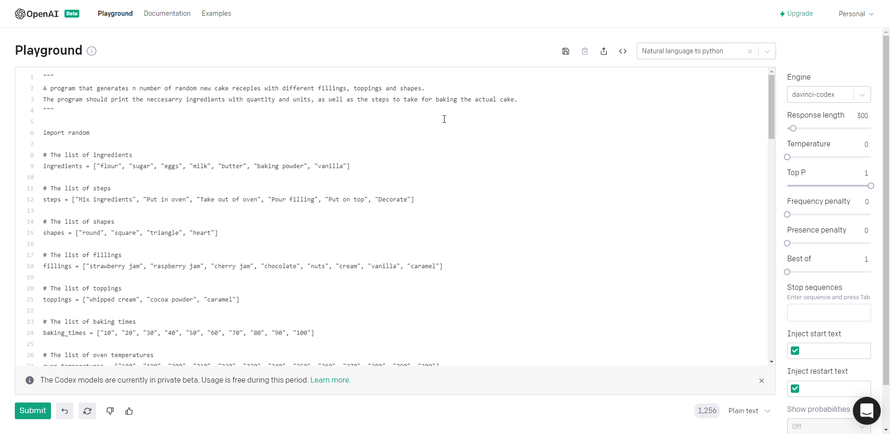

# Cake Generator
 AI generated program for coming up with new cake recipes.

All code is completely written by the [OpenAI Codex](https://openai.com/blog/openai-codex/), an AI system that translates natural language to code.



## Example

```scala
--- Recepie: round muffin ---


--- Ingredients ---
flour: 2 kg
sugar: 1 dl
eggs: 6 cl
milk: 7 l
butter: 10 g
baking powder: 8 dl
vanilla: 8 l


--- Steps ---
1. Mix ingredients
2. Put in oven


--- Filling ---
vanilla


--- Topping ---
whipped cream


--- Duration ---
Expected duration: 32 minutes


--- Baking temperature and method ---
240 degrees Celsius in the toaster


--- Baking ---
Baking temperature: 240 degrees
Baking method: in the toaster
Baking time: 30 minutes


--- Enjoy your cake! ---
```

